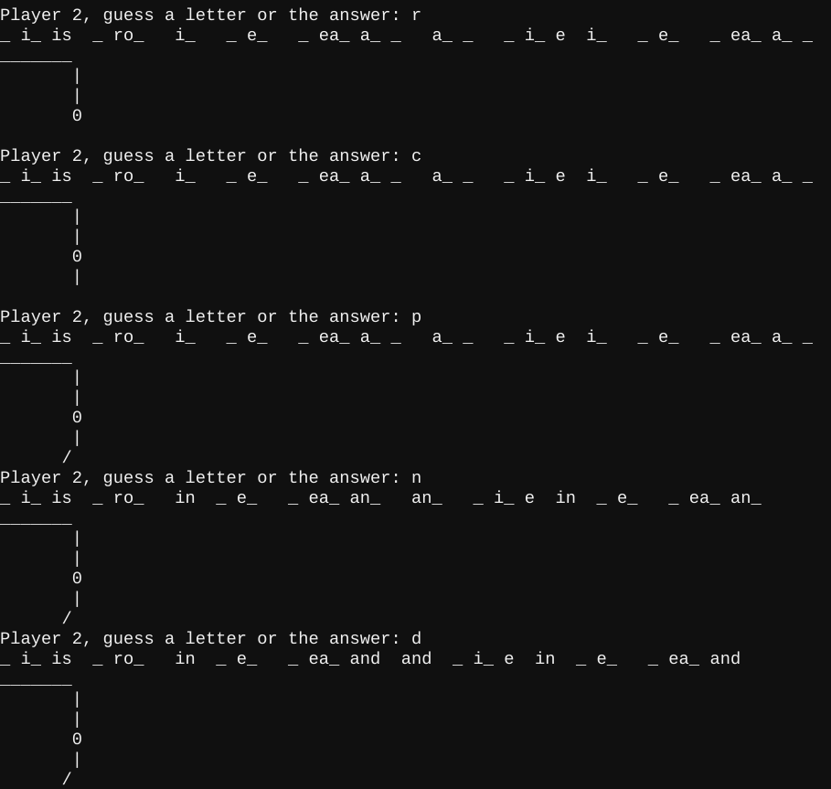
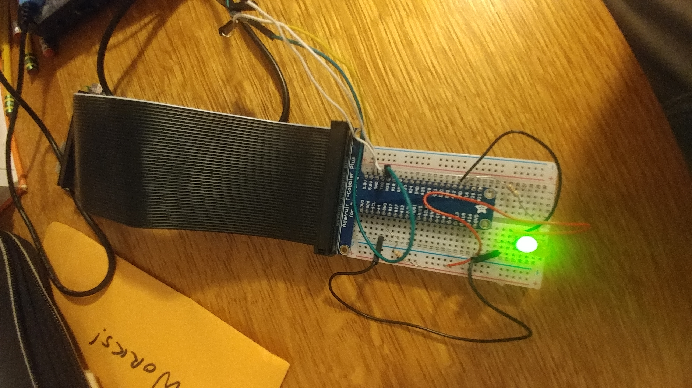
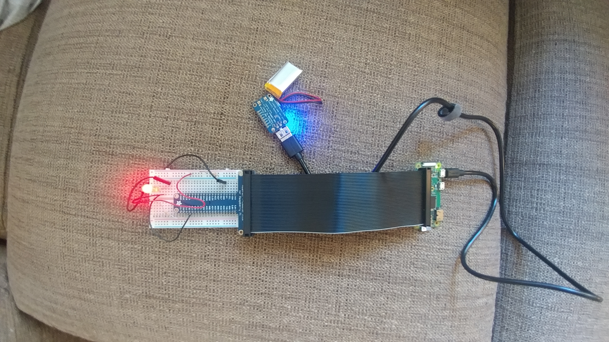
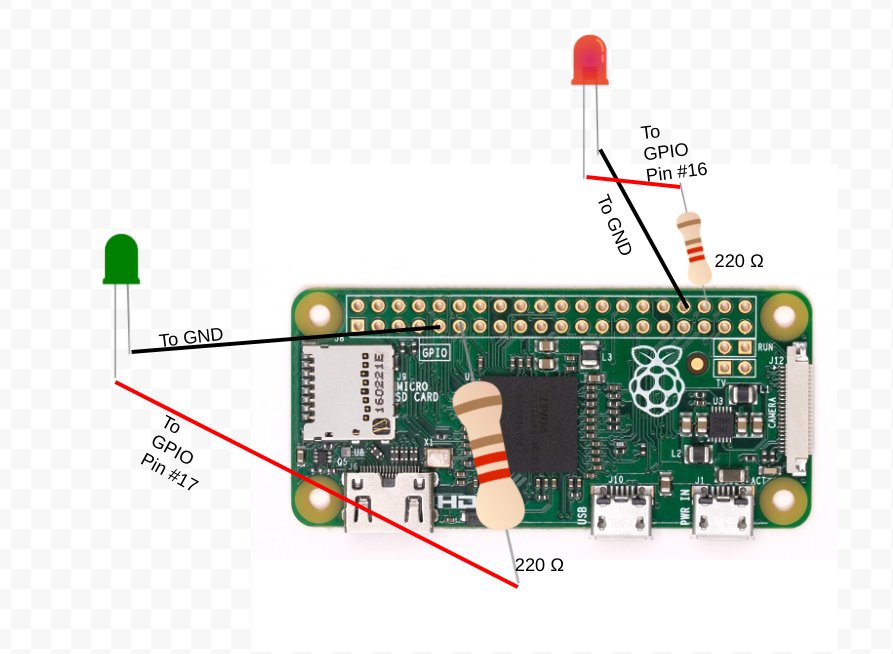
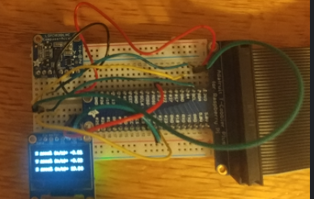
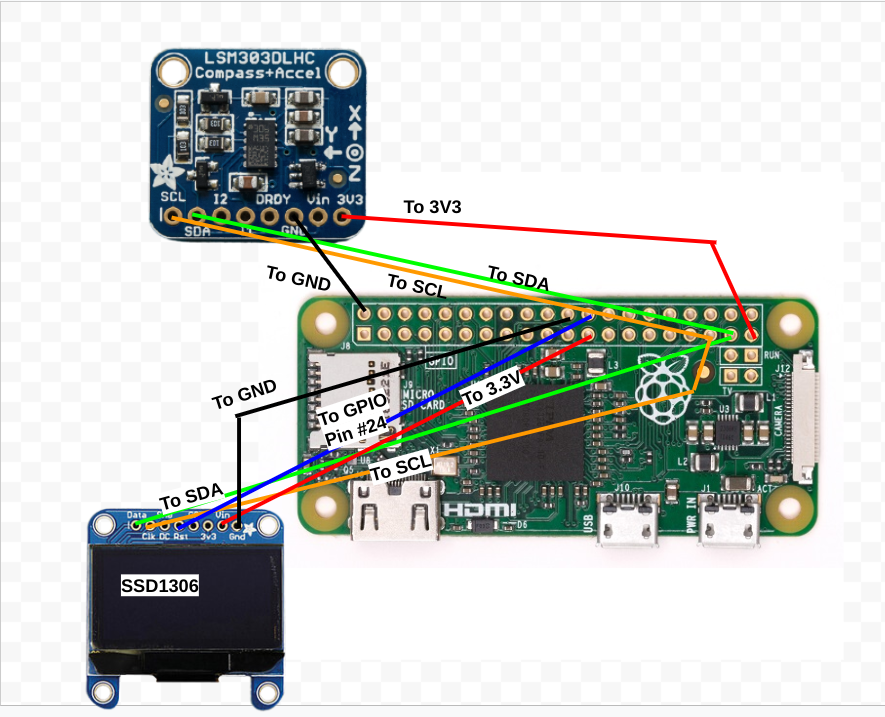
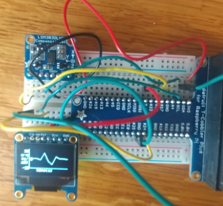
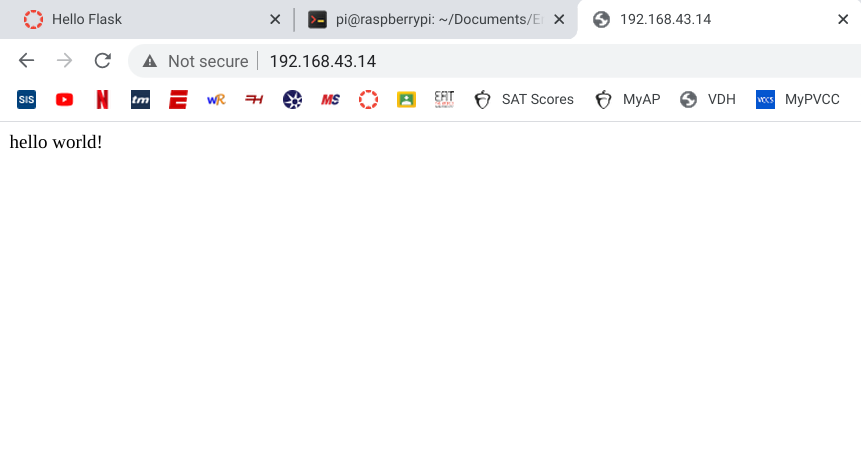
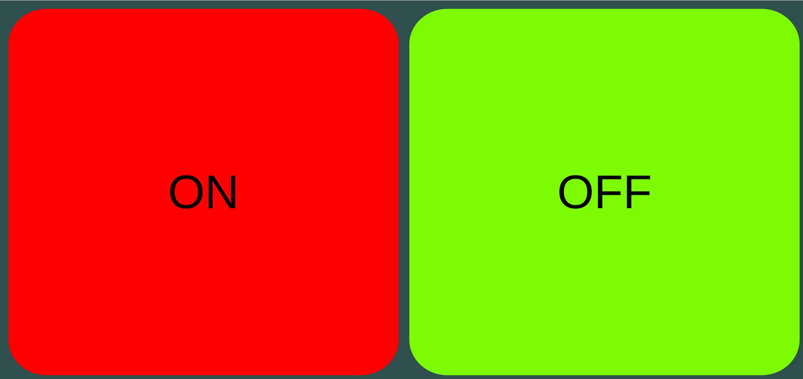

# Engineering 4 Notebook
These are my Engineering 4 assignments to learn to use the Raspberry Pi
## Hello Raspberry Pi

### Reflection
This assignment to me a little while to get started on, because I had to replace my first Pi, which wouldn't even turn on.  However, after I did that, Beagle Term (on a chromebook) proved easy to use, and I learned how to create a new directory ("mkdir") and how to make my first Raspberry Pi program with Beagle Term, by editing the .py file in "nano" and then using "python3" to run it.
## Get Your Pi Online

### Reflection
I was able to connect to my phone's hotspot easily, but I had some major trouble when working in Beagle Term.  I figured out that after I reach the end of a line, it continues to type at the beginning of the same line. This led to me attempting to rename my repository, and then I ran into issues with duplicate directories, and directories within other directories that couldn't be deleted easily. Eventually, I was able to completely delete my old repo and the cooresponding directory and start over (after learning a lot of Linux commands). After this, the rest went fairly smoothly, although I noticed that the "git push origin master" command has been changed to "git push origin main." 
## Hello Python

### Reflection
In this assignment, I created an automatic dice roller, which produces a random number between 1 and 6 every time the user presses enter.  The user also has the ability to end the program by pressing x then enter.  I used the random module (randint function) to generate the dice roll, and I used the input() function to read which keys the user has pressed.  I learned to use a while loop, which will continually run the program to roll a dice everytime enter is pressed, unless the input is equal to x (enter must be pressed every time), in which case the program stops. I had to rename my repository and clone it to my local repo again, but I think I finally have it right this time, and I don't have any duplicate repos anywhere.
## Python Program 01 – Calculator

### Reflection
In this assignment, I created a calculator which will give the sum, difference, product, quotient, and modulo of any two numbers which the user enters. I created a function which used 5 if statements to determine which operation type to perform, and then called the function 5 times, once with each operation type. In order to perform the operations on all numbers, including decimals, I converted the user inputs to float, and then converted them to string after the operation had been run, so that they could be printed.  Although the assignment only required me to round the quotient operation to two decimal places, I decided to round them all, so that it was easier to perform calculations with decimal numbers.  I also decided to use a while loop, like in the dice roller assignment, so that the program could be repeated as many times as desired.
## Python Program 02 – Quadratic Solver

### Reflection
In this assignment, I created a program which will solve any quadratic equation with real roots when the user provides the three coefficients.  To do this, I created an array to store the roots and then created a function which calculates the discriminant of the quadratic, and uses this discriminant to determine how many roots need to be calculated.  The function then stores the roots in the array, so that after the function is called, the program can count the number of roots in the array to determine if there are real roots, and then tell the user that there are no real roots or print the array of roots.  I continued to use a while loop so that the program can be repeated easily.
## Python Program 03 – Strings and Loops

### Reflection
In this assignment, I created a program which will split a user-inputted sentence into its individual letters, with words separated by dashes. To do this, I used the split() function to split the sentence into an array of words, ran each word through a for loop which used the list() function to split it into its letters,  ran these letters through another for loop which printed each letter on its own line, and then placed a dash at the end of each word before the for loop started over with the next word.  
## Python Challenge - Man Shaped Piñata

### Reflection
In this assignment, I created a man shaped piñata (also known as hangman) game, where one player inputs a word or phrase, and the other player must guess the letters in the phrase before all the parts of the piñata/hangman are drawn and it is burst open/killed.  This was by far the longest program I have written on the Raspberry Pi, although there are probably a few redundant lines.  In brief terms, to create this program I split the phrase entered by Player 1 into its letters and stored these letters in one array while creating another array which added a cooresponding blank space for each letter. When Player 2 guessed a correct letter, the program stored the locations of all instances of the correctly guessed letter in a third array called runnums, and then ran this array through a for loop, adding the guessed letter to the blanks array at each location indicated by the runnums array.  Then, the blanks array could be printed out to Player 2, and would only show them the letters they had already guessed, while the other spots remained as blanks. If the user guessed the correct phrase, all blanks would automatically be filled, and when there are no blanks left, the program tells player 1 that they have won.  To draw the man-shaped piñata I had a "wrong" tracker which increased by 1 at every incorrect guess. Depending on the number of wrong guesses, that number of parts of the piñata would be drawn.  One twist to the traditional rules of hangman that I hadn't realized would occur is that the player must specify whether they are guessing a capital or lowercase letter, and in reality this game could include commas, periods, or any type of character printable in Linux.
## GPIO Pins - Bash
 
### Wiring

### Reflection
In this assignment, I used the raspberry pi to control hardware for the first time. Specifically, I made two LEDs alternate blinking 10 times.  I wrote this code in bash, which is relatively easy to understand, but not as easy as Python, and there are a few weird parts, such as not needing spaces before or after equal signs and needing a $ before using a variable to set the condition for a while loop.  As this was my first use of hardware, I also had to figure out how to diagram my wiring.  I ended up just using Google Drawings, which worked surprisingly well.  I just drew lines to represent wires and I was able to find reusable images of the Raspberry Pi, Resistors, and LEDs at the [Raspberry Pi Learning GitHub Repository](https://github.com/raspberrypilearning/components/tree/master/components).  As this repo only had a red LED, I also used [Online PNG Tools](https://onlinepngtools.com/change-png-color) to create a green LED image.
## GPIO Pins - Python
 
### Wiring

### Reflection
To do this assignment, I wrote basically the same code as in the bash assignment, except in Python, which makes more sense. Additionally, the wiring was the exact same. I found it very useful to import all of the functions I needed from the RPi.GPIO library, rather than just importing the library, so I didn't have to type GPIO before every function.  It was helpful to be able to set the board mode to BCM, which allows you to call pins by their number on the pi, rather than their cooresponding, seemingly random "wiring number."  Overall, simple LED code like this was basically the same as in other languages: you set the pins as input or output, then you write each pin as HIGH or LOW.
## GPIO Pins - SSH
 
### Wiring

### Reflection
In this assignment, I used SSH (via the Secure Shell App on the Chromebook) to connect to my Raspberry Pi remotely.  This meant that I was able to log in to my pi and blink LEDs while it was in another room. By far the hardest part of this assignment was getting the pi connected to SSH, but when I realized that all I had to do was make sure that both the pi AND my computer were connected to the same wifi (my phone hotspot), all I had to was log in and run the python code (which I had already written for the previous assignment).  I used the same LED wiring as for the GPIO assignments, except instead of using the USB cable for power, I used the LiPo battery and the power boost for the pi. 
## GPIO Pins - I2C
 
### Wiring

### Reflection
In this assignment, I used the LSM303 accelerometer and the SSD1306 OLED display to display the x, y, and z acceleration values on the OLED screen.  To do this, I installed the relevant libraries for each new piece of hardware. Both of these libraries had example codes which were very useful for me, so in the end, I only had to write a few lines of code: the rest I just copied from the examples (simpletest.py for the accelerometer and shapes.py for the display).  All that I did was divide the the acceleration by 100 to convert it to m/s^2 and format the text correctly on the display.  For my wiring diagram, I used these images for the: [Accelerometer](https://learn.adafruit.com/lsm303-accelerometer-slash-compass-breakout?view=all) and [OLED Display](https://www.reichelt.com/de/en/developer-boards-display-oled-1-3-128x64-pixel-ssd1306-debo-oled-1-3-p235524.html).  I've also found that the free online tool remove.bg is very useful for removing backgrounds from an image.
## Headless
 
### Wiring

### Reflection
In this assignment, I used the code to collect x-component acceleration data from the last assignment, as well as the exact same wiring, and used these values to create a moving line plot of acceleration vs. time.  To do this, I first converted the acceleration (which ranged from -10 to +10) to the 50 unit size of my graph, placed a=0 in the middle.  Then, each time the loop was ran, the newly calculated acceleration values pushed each older value back in time (and to the left on the graph), until the 10th oldest value was pushed out. Since the loop ran so quickly, these gave the appearance of a rapidly moving line, with acceleration pulses that quickly moved through the graph when the accelerometer was moved.  Then, in order to make the program run automatically on startup (without even logging in), I used the sudo nano /etc/rc.local command to edit the rc.local script, which controls the most basic runlevel of the pi. When I was in the file all I had to do was insert this command to automatically run my program: python3 /home/pi/Documents/Engineering_4_Notebook/Python/headless.py.  
## Hello Flask
 
### Reflection
This assignment was very simple; all I had to do was copy the code for a file called app.py, which creates a flask app that allows the raspberry pi to operate as a web server.  This means that when the raspberry pi's IP address was called by another computer on the same network, it will display a website with the words "Hello World!".
## GPIO Pins - Flask
 
### Wiring

### Reflection
In this assignment, I used Flask to create a webpage which had two buttons which a user could use to turn two LEDs on and off (independently).  While I already had the code to turn one LED on and off, the hardest part of this assignment was changing that code so that the two LEDs could be controlled independently.  To do this, in my index.html file, I created two different html forms, one for each LED, each with its own linked button.  These forms both had "hidden inputs" with unique "color" values, and in my app.py file, I used request.form to identify the "color" of the button which was pressed, and then had two separate if statements for each LED. In order to make sure that clicking the button always changed the state of the button, I also had to set up the LEDs as inputs, and then turn them on our off based on a read of their current state.  Finally, I used CSS within my index.html file to stylize my webpage, so that the buttons had their respective colors and filled the entire screen.  I found html code quite tedious and overcomplicated to use, especially for commenting, but it wasn't actually that confusing when I learned the syntax.
